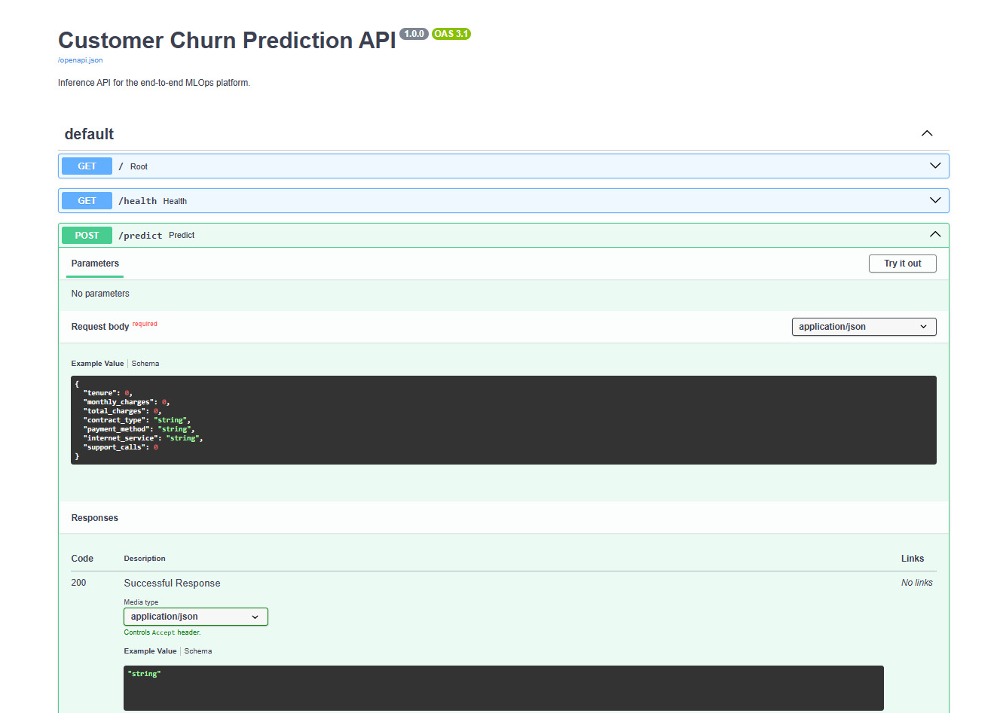

# End-to-End MLOps Platform

A production-style machine learning project for customer churn prediction.

## What this project demonstrates

- Data ingestion and validation
- Feature preprocessing with scikit-learn pipelines
- Logistic Regression, Random Forest, and XGBoost training
- MLflow experiment tracking
- Model evaluation and artifact logging
- FastAPI inference API
- Docker containerization
- Automated tests with pytest
- GitHub Actions CI
- Configuration-driven training
- Clean production-style project structure

## Architecture

```text
Raw CSV
   |
   v
Data Validation
   |
   v
Train/Test Split
   |
   v
Preprocessing Pipeline
   |
   v
Model Training
   |
   +------> MLflow Experiments
   |
   v
Best Model Artifact
   |
   v
FastAPI Prediction Service
   |
   v
Docker / CI
```

## Project Structure

```text
end-to-end-mlops-platform/
├── api/
│   └── main.py
├── configs/
│   └── config.yaml
├── data/
│   ├── raw/
│   └── processed/
├── notebooks/
├── src/
│   ├── data/
│   │   ├── ingest.py
│   │   └── validate.py
│   ├── features/
│   │   └── build_features.py
│   ├── models/
│   │   ├── train.py
│   │   └── predict.py
│   └── utils/
│       └── config.py
├── tests/
│   ├── test_data.py
│   └── test_api.py
├── .github/workflows/ci.yml
├── Dockerfile
├── docker-compose.yml
├── requirements.txt
└── README.md
```

## 1. Create environment

```bash
python -m venv venv
```

Windows:

```bash
venv\Scripts\activate
```

Mac/Linux:

```bash
source venv/bin/activate
```

## 2. Install dependencies

```bash
pip install -r requirements.txt
```

## 3. Generate sample data

The repository contains a script that generates a synthetic churn dataset.

```bash
python scripts/generate_sample_data.py
```

This creates:

```text
data/raw/customer_churn.csv
```

## 4. Train models

```bash
python -m src.models.train
```

The training pipeline compares:

- Logistic Regression
- Random Forest
- XGBoost

The best model is saved to:

```text
artifacts/best_model.joblib
```

## 5. Start MLflow

In another terminal:

```bash
mlflow ui
```

Open:

```text
http://127.0.0.1:5000
```

## 6. Start API

```bash
uvicorn api.main:app --reload
```

Open Swagger:

```text
http://127.0.0.1:8000/docs
```

## API example

POST `/predict`

```json
{
  "tenure": 12,
  "monthly_charges": 79.5,
  "total_charges": 950.0,
  "contract_type": "Month-to-month",
  "payment_method": "Electronic check",
  "internet_service": "Fiber optic",
  "support_calls": 3
}
```

Example response:

```json
{
  "prediction": 1,
  "label": "churn",
  "probability": 0.72
}
```
## API Demo

The FastAPI service exposes an interactive Swagger UI for testing the customer churn prediction endpoint.




## 7. Run tests

```bash
pytest -q
```

## 8. Docker

Build:

```bash
docker build -t churn-ml-api .
```

Run:

```bash
docker run -p 8000:8000 churn-ml-api
```

## 9. GitHub

```bash
git init
git add .
git commit -m "Build end-to-end MLOps churn prediction platform"
git branch -M main
git remote add origin YOUR_GITHUB_REPOSITORY_URL
git push -u origin main
```

## Suggested improvements

After the base version works, extend it with:

- MLflow Model Registry
- Airflow retraining DAG
- Evidently drift detection
- Prometheus/Grafana monitoring
- Kubernetes manifests
- AWS deployment
- Data versioning with DVC
- Feature store integration
